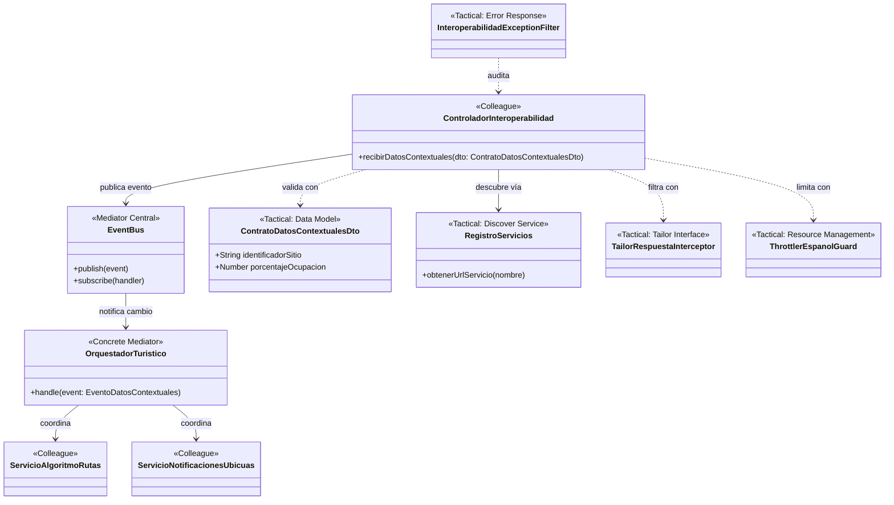
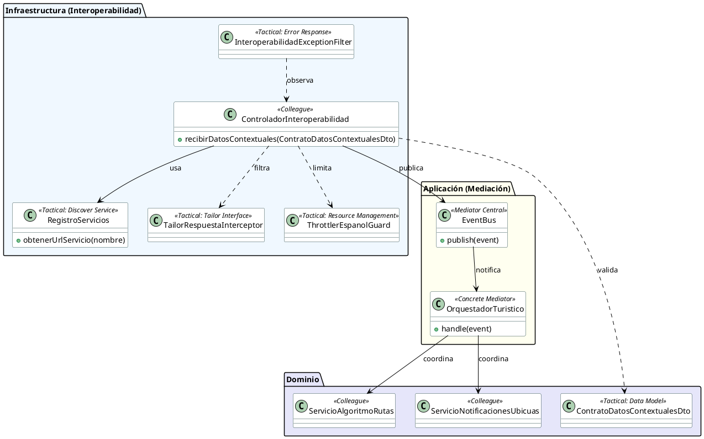

# Diagrama de Clases - Caso de Uso CT010: Consultar Condiciones Externas

Este documento contiene la representación de clases del sistema **Rutas del Tiempo**, enfocándose en cómo el **Caso de Uso CT010** implementa el **Patrón Mediador** y las tácticas de interoperabilidad de **Bass et al. (Capítulo 6)**.

## Visualización Mermaid

## Código PlantUML

