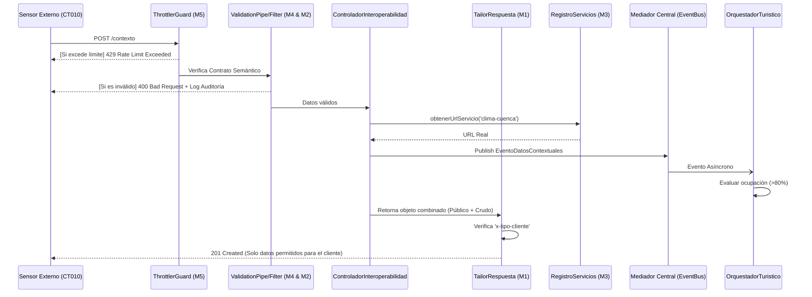
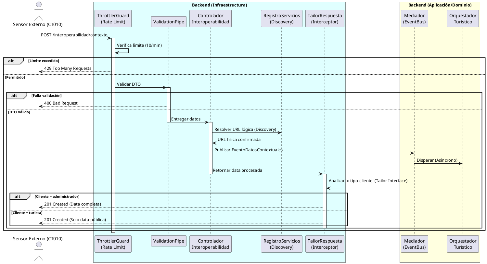

# Diagrama de Secuencia - Caso de Uso CT010: Consultar Condiciones Externas

Este documento detalla el flujo de mensajes y la orquestación de eventos cuando un sensor externo (CT010) envía datos al sistema **Rutas del Tiempo**.

## Visualización Mermaid

## Código PlantUML

